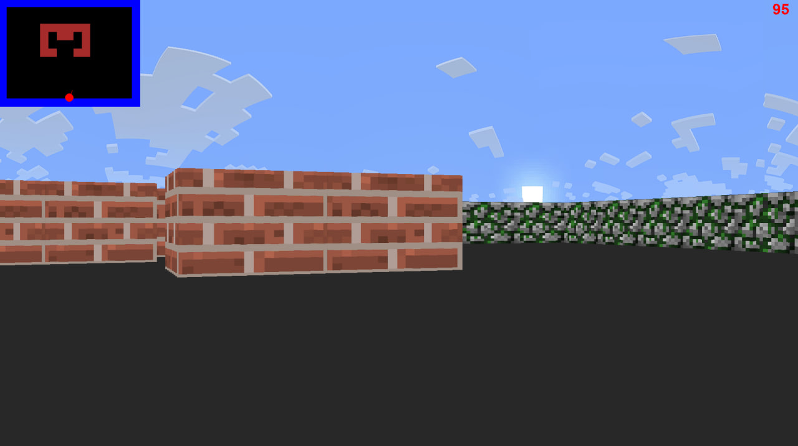

# Ray Casting Game (Pygame + Numba)

## Описание
Проект демонстрирует реализацию 3D-визуализации методом **Ray Casting** на Python с использованием:
- `pygame` — для рендеринга и обработки событий.
- `numba` — для оптимизации вычислений (ray casting, кеширование тригонометрии).
- `numpy` — для работы с числами и векторами.

---

## Возможности
- Движение вперёд/назад и влево/вправо.
- Поворот камеры влево/вправо.
- Обработка столкновений с объектами карты.
- Мини-карта.
- Отрисовка стен с текстурами.
- Отдельные текстуры для неба и пола.
- Отображение текущего FPS.
- Кеширование синусов и косинусов для ускорения.

---

## Управление
- `W` — движение вперёд  
- `S` — движение назад  
- `A` — движение влево  
- `D` — движение вправо  
- `←` — поворот влево  
- `→` — поворот вправо
